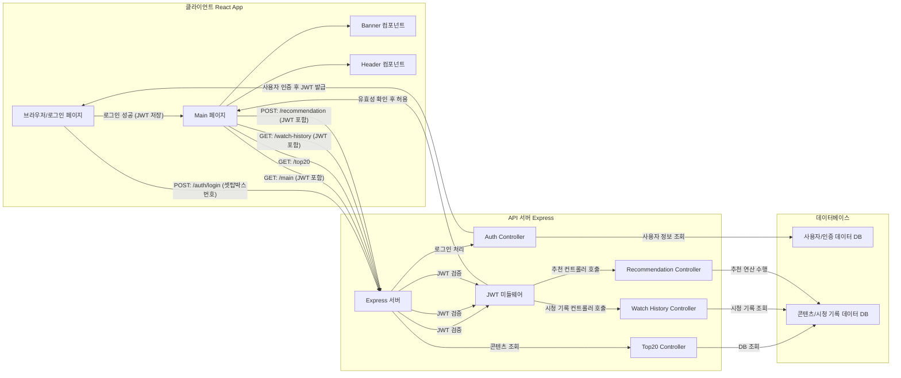

# team3_hellotv
# Hellotv Web Development

# 프로젝트 목표

### 1. 사용자 중심 UI/UX
- **목표**: 직관적이고 모던한 인터페이스로 사용자 경험 최적화
- **구현 기능**:
  - 부드러운 스크롤 애니메이션
  - 반응형 디자인
  - 다크 모드 기반 디자인
  - 호버 효과를 통한 상호작용

### 2. 개인화된 콘텐츠 제공
- **목표**: 사용자별 맞춤형 콘텐츠 추천으로 만족도 향상
- **구현 기능**:
  - 시청 기록 기반 추천
  - 선호 장르 분석
  - 시청 시간대 패턴 분석
  - 실시간 인기 콘텐츠 추천

### 3. 데이터 시각화
- **목표**: 사용자의 시청 패턴을 직관적으로 표현
- **구현 기능**:
  - 장르별 시청 비율 파이 차트
  - 시간대별 시청 패턴 그래프
  - 선호 장르 TOP 5
  - 누적 시청 시간 통계

### 4. 소셜 기능 강화
- **목표**: 사용자 간 콘텐츠 공유와 상호작용 촉진
- **구현 기능**:
  - 시청 기록 공유
  - 개인화된 추천 링크 생성
  - 사용자 고유 해시값 제공

### 5. 성능 최적화
- **목표**: 빠른 로딩 속도와 부드러운 사용자 경험
- **구현 기능**:
  - 이미지 레이지 로딩
  - 컴포넌트 최적화
  - 캐싱 전략 구현
  - API 응답 최적화

### 6. 접근성 향상
- **목표**: 다양한 사용자를 위한 접근성 개선
- **구현 기능**:
  - 키보드 네비게이션
  - 스크린 리더 지원
  - 고대비 모드
  - 반응형 폰트 사이즈

# Project Structure
```plaintext
webTest/
├── client/                        # 프론트엔드 (React + Vite)
│   ├── src/
│   │   ├── components/           
│   │   │   ├── Header/          # 헤더 영역
│   │   │   │   ├── Header.jsx   # 네비게이션, 로고 등
│   │   │   │   └── Header.css
│   │   │   │
│   │   │   ├── Main/            
│   │   │   │   ├── Home/        # 메인 홈페이지
│   │   │   │   │   ├── Home.jsx
│   │   │   │   │   └── Home.css
│   │   │   │   │
│   │   │   │   ├── Recommend/   # 컨텐츠 추천 섹션
│   │   │   │   │   ├── Watching/
│   │   │   │   │   │   ├── TOP20.jsx        # TOP20 컨텐츠 표시
│   │   │   │   │   │   └── ImageCard.jsx    # 컨텐츠 카드 컴포넌트
│   │   │   │   │   └── RecommendContents.jsx
│   │   │   │   │
│   │   │   │   ├── Banner/      # 배너 섹션
│   │   │   │   │   ├── Banner.jsx
│   │   │   │   │   └── Banner.css
│   │   │   │   │
│   │   │   │   └── Search/      # 검색 기능
│   │   │   │       ├── Search.jsx
│   │   │   │       └── Search.css
│   │   │   │
│   │   │   ├── Mypage/          # 사용자 개인화 페이지
│   │   │   │   ├── MyPage.jsx   # 시청 기록 등 표시
│   │   │   │   └── MyPage.css
│   │   │   │
│   │   │   └── Footer/          # 푸터 영역
│   │   │       ├── Footer.jsx
│   │   │       └── Footer.css
│   │   │
│   │   ├── App.jsx              # 라우팅 및 전체 레이아웃
│   │   ├── App.css              
│   │   ├── main.jsx             # React 진입점
│   │   └── index.css            # 글로벌 스타일
│   │
│   └── public/                   # 정적 리소스
│       ├── index.html
│       └── vite.svg
│
├── server/                        # 백엔드 (Express)
│   ├── config/
│   │   └── database.js          # MySQL 연결 설정
│   │
│   ├── controllers/
│   │   └── watchHistoryController.js  # 시청 기록 처리 로직
│   │
│   ├── models/
│   │   └── watchHistory.js      # 시청 기록 데이터 모델
│   │
│   ├── routes/
│   │   └── api.js               # API 라우트 (/api/watch-history 등)
│   │
│   └── utils/
│       └── database.js          # DB 연결 관리
│
├── server.js                      # Express 서버 설정
└── package.json                   # 프로젝트 의존성 및 스크립트

```



# 추천 시스템 설계

## 1. 목표
### 1.1 사용자 경험 향상
- 개인화된 콘텐츠 추천으로 콘텐츠 탐색 시간 단축
- 사용자의 취향과 시청 패턴을 고려한 맞춤형 추천
- 새로운 콘텐츠 발견 기회 제공

### 1.2 서비스 성과 개선
- 사용자 체류 시간 증가
- VOD 서비스 이용률 향상
- 콘텐츠 소비 다양성 확대

### 1.3 기술적 목표
- 실시간 추천 처리 속도 최적화 (목표: 응답시간 1초 이내)
- 추천 정확도 향상 (목표: CTR 15% 이상)
- 시스템 확장성 확보 (일일 활성 사용자 10만명 기준)

## 2. 배경
- VOD 서비스의 콘텐츠가 많아짐에 따라 사용자가 원하는 콘텐츠를 찾기 어려워짐
- 개인화된 추천을 통해 사용자 만족도를 높이고 서비스 이탈률을 낮출 필요성
- 사용자의 시청 패턴과 선호도를 분석하여 맞춤형 콘텐츠 제공 필요

## 3. 추천 시스템 구성
### 2.1 콘텐츠 기반 필터링 (Content-based Filtering)
- 사용자가 시청한 콘텐츠의 장르, 배우, 감독 등의 메타데이터 분석
- 유사한 특성을 가진 콘텐츠를 추천
- 장점: 콜드 스타트 문제 해결, 개인의 취향 반영
- 단점: 다양성 부족 가능성

### 2.2 협업 필터링 (Collaborative Filtering)
- 유사한 취향을 가진 사용자들의 시청 패턴 분석
- 다른 사용자들이 좋아한 콘텐츠를 추천
- 장점: 다양한 장르의 발견 가능
- 단점: 초기 데이터 부족 시 정확도 저하

### 2.3 하이브리드 접근
- 콘텐츠 기반과 협업 필터링을 결합
- 각 방식의 장단점을 보완
- 상황에 따라 적절한 방식 선택

## 4. 주요 추천 알고리즘
1. **장르 기반 추천**
   - 사용자의 시청 이력에서 선호 장르 분석
   - 장르별 가중치 계산 및 적용

2. **시청 시간대 기반 추천**
   - 사용자의 주요 시청 시간대 분석
   - 시간대별 인기 콘텐츠 추천

3. **연관 콘텐츠 추천**
   - 현재 시청 중인 콘텐츠와 유사한 작품 추천
   - 메타데이터 유사도 계산

4. **인기도 기반 추천**
   - 전체 사용자의 시청 통계 활용
   - 트렌드 반영

## 5. 성능 지표
- 클릭률 (CTR)
- 시청 완료율
- 추천 콘텐츠 재시청률
- 사용자 체류 시간

## 6. 향후 개선 방향
- 실시간 추천 시스템 도입
- 딥러닝 모델 적용
- A/B 테스트를 통한 알고리즘 최적화
- 사용자 피드백 시스템 강화
